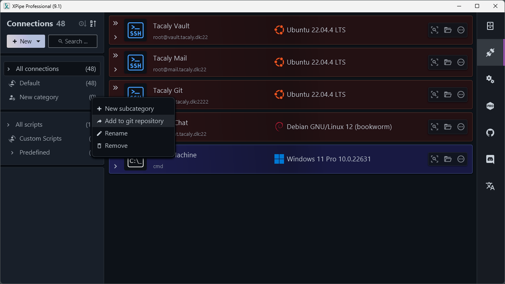

# XPipe Synchronization
`XPipe Synchronization` documentation.  
Here you can find the entire reference sheet for XPIpe Synchronization.

  Current documentation follows version `9.1`.

 
<iframe width="560" height="315" src="https://www.youtube.com/embed/QcUNxa37diM?si=lxXMj0Skjbu-gGCo&amp;controls=0" title="YouTube video player" frameborder="0" allow="accelerometer; autoplay; clipboard-write; encrypted-media; gyroscope; picture-in-picture; web-share" referrerpolicy="strict-origin-when-cross-origin" allowfullscreen></iframe>

Want to have the same connections on other XPipe installs? 
XPipe uses GIT to share the data to other installations of XPipe.

### Synchronizing for the first time
When using the synchronizing funtion for the first time, it is important to have a GIT repository ready. 

**You will need to have the repository set to `private`**.  
(Unless you want the public to know about your server IP address and "keys", very bad SecOps)

Make a `TOKEN` on the git platform of your choice, and save it for later. XPipe will ask every time you start XPipe, unless you setup the token and username in a credential manager or an enviromental argument.

**You can find your (PAT) page here:** 
**Github**: [Personal access tokens (classic)](https://github.com/settings/tokens) 
**GitLab**: [Personal access token](https://docs.gitlab.com/ee/user/profile/personal_access_tokens.html) 
**BitBucket**: [Personal access token](https://support.atlassian.com/bitbucket-cloud/docs/access-tokens/) **Gitea**: `Settings -> Applications -> Manage Access Tokens section` |
Set the token permission for repository to Read and Write. The rest of the token permissions can be set as Read.

Once you have your token you can start XPipe and go to `Settings -> Synchronization` tab and insert your git http url e.g `https://github.com/xpipe-io/xpipe-secret`. Then restart XPipe, and enter your `username` and `TOKEN` when asked.

To have your connections put inside your git repository, you need to right-click on the `⚙️` icon (when hoving over the category) in your `connections` tab under the `category` overview on the left side. Press `Add to git repository`, to sync the category and connections to your git repository. (It will sync in the background, so no need to worry.)

And TA-DA!! 🎉 You now have all your connections in your git repository.

### It won't sync with my git repository?
(This will however be fix'd in a future release)
- Check if the git lang. on your system is English.
- Check if you have the correct login information or URL to the repository.